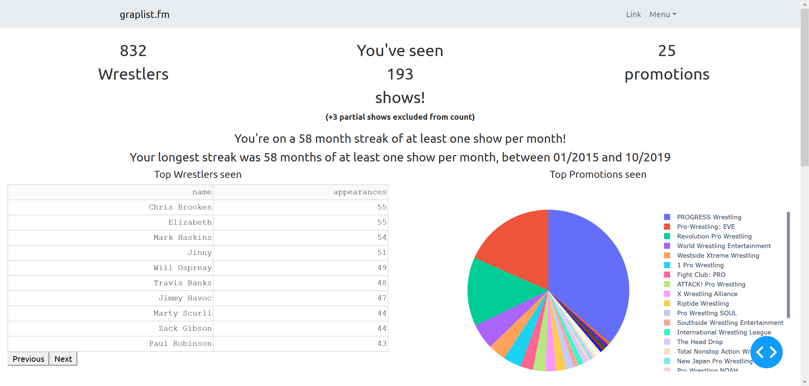

- [Why?](#why)
- [How?](#how)
  * [TL;DR](#tldr)
  * [Prerequisites](#prerequisites)
  * [Shows list](#shows-list)
    + [Features](#features)
      - [Merge shows (`merge`, `taping`, `squash`)](#merge-shows-merge-taping-squash)
      - [Partial shows (`partial`)](#partial-shows-partial)
    + [Example](#example)
  * [graps.py](#grapspy)
    + [Usage](#usage)
  * [app.py](#apppy)
- [Known Issues](#known-issues)
- [""""Roadmap""""](#roadmap)

# Why?

I always wanted some stats on shows I'd attended. Not like obsessing over counting quarter stars and worker average star levels, but like how many times I've seen promotion X or wrestler Y. [setlist.fm](https://www.setlist.fm/concerts/gordonjb) is a good comparison point.

Some people have spreadsheets. That seemed like a massive pain, so as they have no API, I decided to scrape Cagematch and learn some Python and data visualisation. Because that's SO much easier.



# How?

For the moment, this is a far more involved process for the non technical than I would like. The dream is a persistent online service people can use, but I don't know how far off that is. In the meantime, read on...

## TL;DR

[Clone this repository](https://help.github.com/en/articles/cloning-a-repository) and then `cd` into that directory.

To delete the previous database and reload shows: `rm -f thedatabase.sqlite3 && pipenv run python graps.py`

To run the dashboard: `pipenv run python app.py` and go to http://localhost:8050

## Prerequisites

Both ingest and the dashboard require Python 3. You can install the dependencies manually, but the easiest thing to do is to use [pipenv](https://pipenv.readthedocs.io/en/latest/). Your best bet is probably to Google an installation guide, especially if you're planning to run this on Windows. Or just do what I did and use Windows Subsystem for Linux (WSL).

On Ubuntu,

```bash
sudo apt install python-pip
pip install pipenv
```

The list of Python dependencies used can be found in the [Pipfile](Pipfile) [or viewed on the repository's Dependencies page](https://github.com/gordonjb/graplist.fm/network/dependencies)

## Shows list

The list of attended shows is sourced from a [YAML](https://rollout.io/blog/yaml-tutorial-everything-you-need-get-started/) file, by default this is `shows.yaml` in the root of the repository. This can be changed by passing `-f [file location]` to the script (this will be described below).

At it's most basic, shows.yaml is just a top level YAML list of show URLs:

```yaml
- https://www.cagematch.net/?id=1&nr=244194
- https://www.cagematch.net/?id=1&nr=241265
- https://www.cagematch.net/?id=1&nr=244175
```

To add shows to the list that will be considered, add a new line containing the text `- ` followed by the URL of the show page from Cagematch. The `- ` syntax creates a list in YAML.

One advantage of using YAML is that you can also use comments to identify links in any way you choose. Comments are created by typing `#`. All text that follows on that line will be ignored when the file is loaded in. This makes it easy to keep track of which URL is which. For instance you could indicate the show with a comment at the end of the line:

```yaml
- https://www.cagematch.net/?id=1&nr=242190 # Beyond Sodom And Gomorrah 12/10/2019
- https://www.cagematch.net/?id=1&nr=230613 # Breed Pro Starrcave 12/10/2019
#- https://www.cagematch.net/?id=1&nr=226480 This link will be ignored, for example
```

or you could use comment lines:

```yaml
# Beyond Sodom And Gomorrah
- https://www.cagematch.net/?id=1&nr=242190
# Breed Pro Starrcave
- https://www.cagematch.net/?id=1&nr=230613
# This link will be ignored, for example:
#- https://www.cagematch.net/?id=1&nr=226480
```

or however you choose. In my personal file, I've used whole line comments to separate months and then added show names at the end of each line.

### Features

Not every entry is just a URL however. Special types of shows can be created using certain keywords. The following "feature" entry keywords are supported:

**_Note_: indentation is important in YAML. You should follow the indentation patterns in the example below.**

#### Merge shows (`merge`, `taping`, `squash`)

When it comes to TV shows, Cagematch tends to create a show page for each show even if they were taped in one go. If you want to stick these back together, the `merge` keyword will do this. To use it, use `merge:` as your top level list item, and then include an indented list of the show pages you want to be merged:

```yaml
- merge:
    - https://www.cagematch.net/?id=1&nr=94859 # WWE Friday Night SmackDown #714
    - https://www.cagematch.net/?id=1&nr=94858 # WWE Main Event #30
```

You can merge as many shows as you want together:

```yaml
- merge:
    - https://www.cagematch.net/?id=1&nr=129265
    - https://www.cagematch.net/?id=1&nr=129881
    - https://www.cagematch.net/?id=1&nr=130380
    - https://www.cagematch.net/?id=1&nr=127390
```

The keywords `merge`, `taping` and `squash` are interchangeable, and you can use whichever you prefer, or any combination:

```yaml
- squash:
    - https://www.cagematch.net/?id=1&nr=94826 # WWE Monday Night RAW #1039
    - https://www.cagematch.net/?id=1&nr=95125 # WWE Superstars #211
- merge:
    - https://www.cagematch.net/?id=1&nr=94859 # WWE Friday Night SmackDown #714
    - https://www.cagematch.net/?id=1&nr=94858 # WWE Main Event #30
- https://www.cagematch.net/?id=1&nr=102710 # WWE Live Leeds
- taping:
    - https://www.cagematch.net/?id=1&nr=111347 # WWE Friday Night SmackDown #770
    - https://www.cagematch.net/?id=1&nr=111345 # WWE Main Event #86
```

#### Partial shows (`partial`)

Sometimes, you didn't see an entire show. In this case, you can stop wrestlers you didn't see getting an appearance credit by indicating the matches that you missed using the `partial` feature. For instance, to exclude the last two matches of [this show](https://www.cagematch.net/?id=1&nr=239089), do the following:

```yaml
- partial:
    url: https://www.cagematch.net/?id=1&nr=239089
    exclude: [4,5]
```

As you could probably guess, the `url` key indicates the show URL as you would have entered, and the `exclude` key indicates the matches you missed. This is a comma separated list, with the first match being match 1, regardless of if it's a dark match. The numbers don't need to be in order or continuous.

If you missed almost all of the show, you may not want to count it in your overall totals. In this case, use the `exclude_from_count` key:

```yaml
- partial:
    url: https://www.cagematch.net/?id=1&nr=236880
    exclude: [2,3,5]
    exclude_from_count: True
```

Partial shows can be combined with other shows, partial or otherwise, using the same merge feature:

```yaml
- merge:
    - partial:
        url: https://www.cagematch.net/?id=1&nr=242611
        exclude: [1]
    - https://www.cagematch.net/?id=1&nr=242612
```

`exclude_from_count` will be ignored in this case. If that's a problem for you, [raise an issue](https://github.com/gordonjb/graplist.fm/issues/new) and let me know.

### Example

My personal shows.yaml is in the repo, for comparison: [shows.yaml](shows.yaml)

## graps.py

`graps.py` is the portion responsible for taking the Cagematch pages and parsing them into a database. Running the script through python will (by default) load `shows.yaml` and parse it into a backing database for the front end.

The parsed data is stored in a SQLite database. To remove the database so you can reload data from scratch, delete the database file, `thedatabase.sqlite3`.

**_Note_: Currently you'll need to do this every time you add new shows, this will be fixed at some point! 🤞🤞**

To avoid making too many requests, Cagematch pages are cached locally when retrieved. The tool will print out as it loads whether a page was downloaded fresh or retrieved from the cache. If the information on a page has changed since it was first retrieved, deleting the cache database (`cagematch_cache.sqlite`) will cause all pages to be reloaded on the next run.

### Usage

```
usage: graps.py [-h] [-f FILE] [-v] [-t] [-p]

Scrape and parse a list of shows

optional arguments:
  -h, --help            show this help message and exit
  -f FILE, --file FILE  file to be loaded
  -v, --verbose         output more info about what's being parsed
  -t, --no-translations
                        don't perform translations, e.g Tag -> Day in show
                        names
  -p, --profile         run profiling
```

## app.py

To start the webserver delivering the front end, run `app.py` through Python. The console will display the URL the webserver has declared.

# Known Issues

[Planned enhancements and known bugs are tracked in Issues, feel free to raise any suggestions you have or issues you encounter](https://github.com/gordonjb/graplist.fm/issues?q=is%3Aissue+is%3Aopen+sort%3Aupdated-desc)

# """"Roadmap""""

The vague future plans I have and stuff that's being looked at "currently" (read: when I feel like playing around with it) is tracked on the [project TODO board](https://github.com/gordonjb/graplist.fm/projects/3).

The main items still todo are:

- Add a way to include shows not on Cagematch. Probably some method to load YAML from a file or directory that includes the metadata we need.
- Initially, this is a locally run thing, requiring Python etc. I'd like to get it to a place where it's something online, or at least something you just need to dump a list of shows into. Then you're starting to get into accounts and webservers and deployments and stuff I have even less experience in, so that may be a way off!
